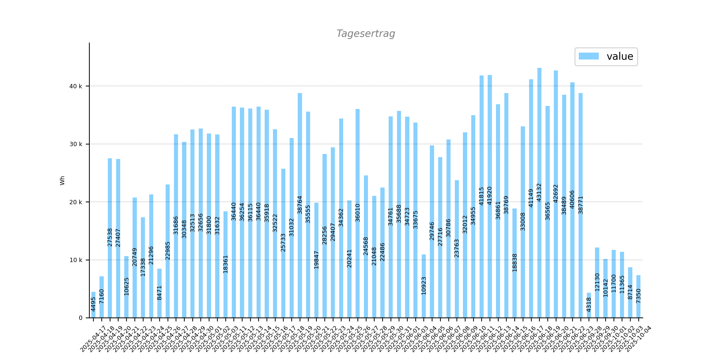

# Solar

## SMA Device

Based on https://hoerli.net/openhab-sma-wechselrichter-via-modbus-anbinden/

Your to dos:
- Rename the file [secrets.rename_env](./config/openhab/secrets.rename_env) into secrets.env
- Adapt the items properly